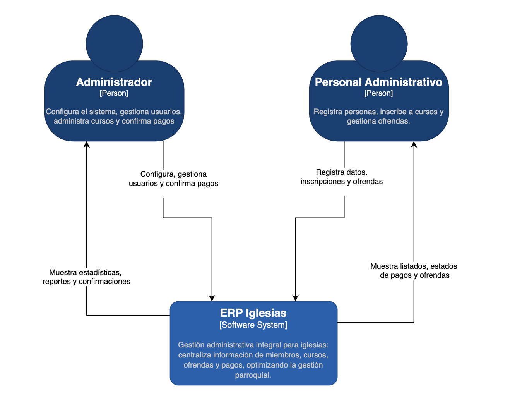
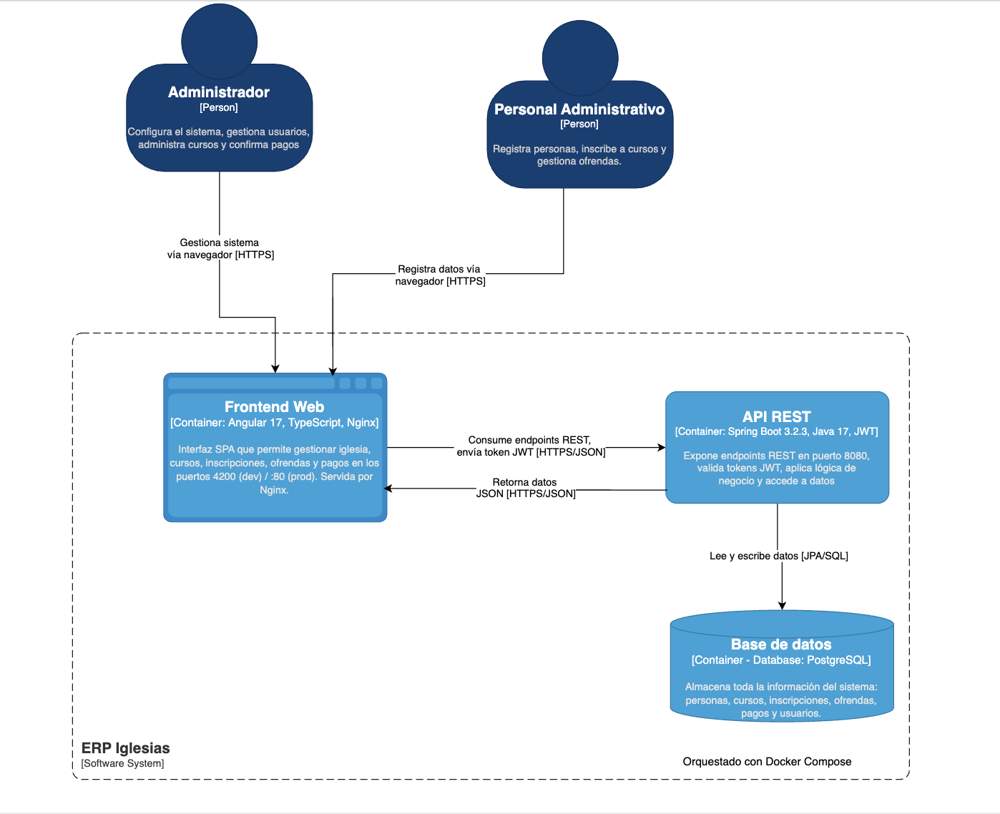

# Documentación Arquitectónica C4
## ERP Iglesias — Sistema de Gestión Administrativa

---

**Actividad:** Diagramas de Arquitectura C4  
**Estudiante:** Karina Cantillo Plaza  
**Profesor:** Luis Ángel Vargas  
**Materia:** Arquitectura de Software — Sexto Semestre  
**Fecha:** Marzo 2025  
**Repositorio:** `lanvargas94/erp_iglesias`

---

## Tabla de Contenidos

- [Introducción](#introducción)
- [Nivel 1 — Diagrama de Contexto](#nivel-1--diagrama-de-contexto)
- [Nivel 2 — Diagrama de Contenedores](#nivel-2--diagrama-de-contenedores)
- [Nivel 3 — Diagrama de Componentes](#nivel-3--diagrama-de-componentes)
- [Conclusión](#conclusión)

---

## Introducción

**ERP Iglesias** es una aplicación web de gestión administrativa diseñada para iglesias. Permite administrar miembros (personas), cursos, inscripciones, ofrendas y pagos, con un esquema de control de acceso basado en roles (`ADMIN` y `CLIENT`).

El sistema sigue una arquitectura cliente-servidor moderna:

| Capa | Tecnología | Versión |
|------|-----------|---------|
| Frontend | Angular + TypeScript + Nginx | Angular 17.3 |
| Backend | Java + Spring Boot | Java 17 / SB 3.2.3 |
| Seguridad | Spring Security + JWT | jjwt 0.11.5 |
| Base de datos | PostgreSQL | Latest |
| Infraestructura | Docker + Docker Compose | Latest |

Este documento presenta la arquitectura del sistema mediante el **modelo C4**, en tres niveles de abstracción: Contexto, Contenedores y Componentes. Cada nivel responde a una pregunta arquitectónica específica y se construye sobre el anterior, manteniendo coherencia a lo largo de toda la documentación.

---

## Nivel 1 — Diagrama de Contexto

### ¿Qué muestra este diagrama?

El Diagrama de Contexto representa el sistema ERP Iglesias como una **caja negra**, mostrando únicamente su alcance y las interacciones con los actores externos. No revela ningún detalle tecnológico interno. Es el nivel más alto de abstracción del modelo C4 y responde a la pregunta: *¿qué es el sistema y con quién interactúa?*

### Diagrama

>`C1_Contexto.png`

---

### Explicación

#### Actores identificados

Se identificaron dos actores directos del sistema, basados en los roles definidos en el código fuente (`UserRole.java`):

**Administrador del sistema** corresponde al rol `ADMIN` en el backend. Es el actor estratégico: configura la iglesia (con restricción de una única entidad por sistema), gestiona los usuarios del sistema, administra el catálogo de cursos y confirma o rechaza pagos. Su rol está orientado a la supervisión y control global.

**Personal Administrativo** corresponde al rol `CLIENT` en el backend. Es el actor operativo: registra miembros (personas), gestiona inscripciones a cursos, registra ofrendas y consulta estados de pagos y reportes. Su interacción es constante y centrada en la gestión diaria.

#### ¿Por qué elegimos estos elementos?

Se eligieron exactamente los actores que existen en el código fuente del proyecto, específicamente en el enum `UserRole` que define `ADMIN` y `CLIENT`. No se inventaron roles adicionales para mantener fidelidad al sistema real. No se identificaron sistemas externos integrados, ya que el repositorio no contiene integraciones con pasarelas de pago, servicios de correo ni APIs externas — el sistema es una solución autónoma.

#### ¿Cómo se relacionan entre sí?

Las relaciones son **bidireccionales**: los actores envían solicitudes al sistema mediante `HTTPS` y reciben respuestas en formato `JSON`:

- El **Administrador** configura el sistema, gestiona usuarios y confirma pagos vía navegador web.
- El **Personal Administrativo** registra datos operativos y consulta información vía navegador web.
- El sistema retorna confirmaciones, listados y reportes a ambos actores.

#### ¿Qué nivel C4 representa?

Este diagrama representa el **Nivel 1 (Contexto)** del modelo C4. Su propósito es establecer el límite del sistema y su entorno, sin revelar decisiones tecnológicas internas.

#### Decisiones y supuestos tomados

- Se decidió **no incluir un actor de acceso público** porque el sistema requiere autenticación para todas sus rutas (`anyRequest().authenticated()` en `SecurityConfig.java`). No existe acceso anónimo.
- Se decidió **no incluir sistemas externos** porque no hay evidencia en el repositorio de integraciones con servicios de terceros.
- Se asumió que ambos actores acceden desde un **navegador web estándar**, consistente con la arquitectura SPA de Angular.

---

## Nivel 2 — Diagrama de Contenedores

### ¿Qué muestra este diagrama?

El Diagrama de Contenedores amplía el sistema ERP Iglesias y muestra las **piezas tecnológicas** que lo componen: las aplicaciones y almacenes de datos que se ejecutan para que el sistema funcione. Responde a la pregunta: *¿cómo está dividido el sistema a nivel tecnológico?*

### Diagrama

>  `C2_Contenedores.png`

---

### Explicación

#### Contenedores identificados

Se identificaron tres contenedores, todos evidenciados directamente en el repositorio:

**Frontend Web** (`Angular 17 + TypeScript + Nginx`) es la aplicación de una sola página que presenta la interfaz de usuario. En desarrollo se ejecuta en el puerto `:4200` mediante `ng serve`. En producción, los archivos compilados son servidos por Nginx en el puerto `:80`, como se evidencia en el archivo `nginx.conf` del proyecto.

**API REST** (`Spring Boot 3.2.3 + Java 17 + JWT`) contiene toda la lógica de negocio del sistema. Expone endpoints REST en el puerto `:8080`, valida tokens JWT mediante `JwtAuthFilter`, aplica reglas de negocio en los servicios y accede a los datos mediante JPA. Es el contenedor central del sistema.

**Base de datos** (`PostgreSQL`) almacena de forma persistente toda la información del dominio: personas, cursos, inscripciones, ofrendas, pagos y usuarios. Se comunica con el backend mediante JDBC/JPA (Hibernate), configurado en `application.properties`.

#### ¿Por qué elegimos estos elementos?

Los tres contenedores se eligieron porque están **directamente evidenciados** en el repositorio:
- El frontend existe en `frontend/` con su `package.json` (Angular 17.3) y `nginx.conf`
- El backend existe en `backend/` con su `pom.xml` (Spring Boot 3.2.3)
- La base de datos está definida en `docker-compose.yml` como servicio `postgres`

No se agregaron contenedores adicionales (caché, colas de mensajes) porque no hay evidencia de ellos en el repositorio.

#### ¿Cómo se relacionan entre sí?

El flujo de una petición típica es:

1. Los actores acceden al **Frontend Web** mediante `HTTPS` desde el navegador
2. El **Frontend Web** consume los endpoints del **API REST** enviando peticiones `HTTP/JSON` con el token JWT en el encabezado `Authorization`
3. El **API REST** retorna respuestas `JSON` al frontend
4. El **API REST** lee y escribe datos en la **Base de datos** mediante `JPA/SQL`

Todos los contenedores son orquestados con **Docker Compose**, definido en `docker-compose.yml`.

#### ¿Qué nivel C4 representa?

Este diagrama representa el **Nivel 2 (Contenedores)** del modelo C4. Muestra las decisiones tecnológicas principales y cómo los contenedores se comunican entre sí.

#### Decisiones y supuestos tomados

- Se decidió **integrar Nginx dentro del contenedor Frontend** (no como contenedor separado) porque en el `Dockerfile` del frontend, Nginx y Angular están en el mismo contenedor en un proceso de build multi-stage.
- Se incluyó **Docker Compose como nota de orquestación** en la descripción, pero no como contenedor, ya que es una herramienta de despliegue, no una aplicación en ejecución.
- Se especificaron los **puertos reales** del proyecto (`:8080`, `:4200`, `:80`) porque están definidos en `docker-compose.yml` y `application.properties`.

---

# Nivel 3 — Diagrama de Componentes (Sistema Original)

### ¿Qué muestra este diagrama?

El Diagrama de Componentes profundiza en el interior del contenedor **Backend API (Spring Boot)**, mostrando la estructura interna del sistema en su estado **original**, antes de aplicar las mejoras arquitectónicas documentadas en los ADRs. Responde a la pregunta: *¿qué hay dentro del backend en su versión inicial?*

### Diagrama

> `C3_Componentes.png`

---

### Explicación

#### Componentes identificados

Se identificaron cuatro componentes en el sistema original:

**Seguridad JWT** (`JwtAuthFilter`, `JwtService`, `SecurityConfig`) es el componente transversal que intercepta todas las peticiones HTTP antes de que lleguen a los controladores. Valida el token JWT, extrae el rol del usuario y establece la autenticación en el contexto de Spring Security, habilitando la autorización con `@PreAuthorize`.

**Controladores REST** (`AuthController`, `ChurchController`, `CourseController`, `EnrollmentController`, `OfferingController`, `PaymentController`, `PersonController`) son el componente central del sistema original. A diferencia de una arquitectura en capas bien definida, en esta versión los controladores concentran **múltiples responsabilidades**: reciben las peticiones HTTP, contienen la lógica de negocio, validan reglas de dominio, acceden directamente a los repositorios y construyen las respuestas. Esto genera un alto acoplamiento y dificulta el mantenimiento y las pruebas unitarias.

**Repositorios JPA** (`ChurchRepository`, `CourseRepository`, `EnrollmentRepository`, `OfferingRepository`, `PaymentRepository`, `PersonRepository`, `AppUserRepository`) son la capa de abstracción sobre la base de datos mediante Spring Data JPA. En el sistema original, son accedidos **directamente** desde los controladores, sin pasar por una capa de servicios intermedia.

**Entidades JPA** (`Church`, `Course`, `Enrollment`, `Offering`, `Payment`, `Person`, `AppUser`) modelan las tablas de la base de datos y sus relaciones mediante anotaciones Hibernate. Son construidas y manipuladas directamente por los repositorios.

#### ¿Por qué elegimos estos elementos?

Se eligieron estos componentes porque representan las **unidades funcionales reales** del backend original. Se omitieron servicios, DTOs independientes y manejador de excepciones porque **no existían** en el sistema original — estos fueron introducidos posteriormente mediante los ADRs implementados.

Se eligió el **backend como contenedor a profundizar** porque es donde se concentra la mayor complejidad arquitectónica del sistema y donde se identificaron los principales problemas de diseño.

#### ¿Cómo se relacionan entre sí?

El flujo de una petición en el sistema original es:

1. El **Frontend Web** envía una petición con token JWT al backend
2. **Seguridad JWT** intercepta la petición, valida el token y autoriza el acceso
3. Los **Controladores REST** reciben la petición, aplican la lógica de negocio internamente y acceden **directamente** a los **Repositorios JPA**
4. Los **Repositorios JPA** construyen y manipulan **Entidades JPA**
5. Las **Entidades JPA** ejecutan operaciones SQL sobre la **Base de datos PostgreSQL**

A diferencia de una arquitectura bien estructurada, las dependencias no fluyen en una dirección única — los controladores conocen tanto la lógica de negocio como la capa de datos, generando alto acoplamiento.

#### ¿Qué nivel C4 representa?

Este diagrama representa el **Nivel 3 (Componentes)** del modelo C4. Muestra la estructura interna del contenedor Backend en su estado original, evidenciando los problemas arquitectónicos que motivaron las mejoras documentadas en los ADRs.

#### Decisiones y supuestos tomados

- Se decidió **no incluir servicios** porque en el sistema original no existía una capa de servicios — la lógica de negocio vivía directamente en los controladores, como se evidencia en los archivos `EnrollmentController.java`, `OfferingController.java` y `PaymentController.java` del repositorio original.
- Se decidió **no incluir DTOs independientes** porque en el sistema original los records de transferencia de datos estaban definidos como clases internas de los controladores.
- Se decidió **no incluir GlobalExceptionHandler** porque no existía en el sistema original — cada controlador manejaba sus errores de forma individual con `ResponseStatusException`.
- Se identificó como **problema arquitectónico principal** que los controladores violaban el Principio de Responsabilidad Única (SRP) al concentrar múltiples responsabilidades, lo cual motivó las mejoras implementadas en los ADRs.

## Conclusión

La arquitectura de ERP Iglesias sigue un patrón de **tres capas** 
(presentación, lógica, datos), analizado a través de los tres 
niveles del modelo C4.

Los tres niveles mantienen coherencia entre sí:

| Nivel C4 | Elemento | Se descompone en |
|----------|---------|-----------------|
| Contexto (N1) | ERP Iglesias | ↓ |
| Contenedores (N2) | Frontend + API REST + PostgreSQL | ↓ |
| Componentes (N3) | Controllers + Repositories + Security + Entities | — |

El análisis del sistema original evidenció los siguientes 
problemas arquitectónicos:

- Los **Controladores REST** concentraban múltiples 
responsabilidades, violando el Principio de Responsabilidad 
Única (SRP)
- No existía una **capa de servicios** — la lógica de negocio 
vivía directamente en los controllers
- Los **DTOs** estaban acoplados como clases internas de los 
controllers
- No había un **manejador global de excepciones** — cada 
controller manejaba errores de forma inconsistente

Estos hallazgos motivaron las mejoras arquitectónicas 
documentadas en los ADRs del proyecto, aplicando principios 
**SOLID** y patrones de diseño reconocidos en la industria, 
logrando un sistema más mantenible, escalable y testeable.

---

*Actividad C4 — Arquitectura de Software · Marzo 2025*  
*Karina Cantillo Plaza · Profesor: Luis Ángel Vargas*