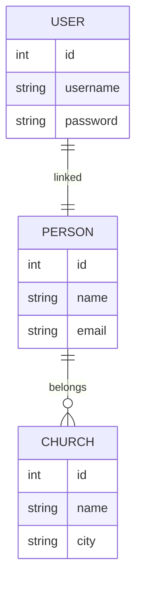

# ERP Iglesias — Refactorización Arquitectónica

## Parcial 1 — Arquitectura de Software

Este repositorio contiene el desarrollo del **Parcial 1 de Arquitectura de Software**, enfocado en la **auditoría, documentación y refactorización incremental** del sistema **ERP Iglesias**.

El objetivo es analizar la arquitectura actual del sistema, identificar problemas de diseño y proponer mejoras aplicando principios de ingeniería de software.

Se aplican:

- **SOLID**
- **Clean Code**
- **Architecture Decision Records (ADR)**

---

# Contenido

- [Integrantes](#integrantes)
- [Propósito del repositorio](#propósito-del-repositorio)
- [Objetivos](#objetivos)
- [Tecnologías del sistema](#tecnologías-del-sistema)
- [Arquitectura del sistema](#arquitectura-del-sistema)
- [Modelo Entidad Relación](#modelo-entidad-relación)
- [Estructura del repositorio](#estructura-del-repositorio)
- [ADR — Architecture Decision Records](#adr--architecture-decision-records)
- [Evidencias](#evidencias)
- [Cambios implementados](#cambios-implementados)
- [Cómo ejecutar el proyecto](#cómo-ejecutar-el-proyecto)

---

# Integrantes

- **Juan Sebastián Osorio Fierro**
- **Karina Cantillo Plaza**

---

# Propósito del repositorio

Este repositorio tiene como objetivo evidenciar el proceso de **refactorización arquitectónica de un sistema existente**, documentando tanto las decisiones arquitectónicas como los cambios implementados sobre el código fuente.

La refactorización se realiza de forma **incremental**, con el fin de evitar afectar el comportamiento funcional del sistema y mantener su estabilidad.

---

# Objetivos

- Identificar problemas arquitectónicos del sistema actual.
- Proponer mejoras de diseño utilizando **principios SOLID**.
- Documentar decisiones mediante **Architecture Decision Records (ADR)**.
- Mejorar la mantenibilidad y legibilidad del código.
- Evidenciar cambios mediante **commits e imágenes de evidencia**.

---

# Tecnologías del sistema

## Backend

- Java 17
- Spring Boot
- Spring Security
- Spring Data JPA
- PostgreSQL
- JWT

## Frontend

- Angular

## Infraestructura

- Docker
- Docker Compose

---

# Arquitectura del sistema

El sistema sigue una arquitectura basada en capas:

Controller
↓
Service
↓
Repository
↓
Database

Esta arquitectura permite:

- Separación de responsabilidades
- Mayor mantenibilidad
- Mejor organización del código
- Facilidad de pruebas

---

# Modelo Entidad Relación



Este modelo representa las entidades principales del sistema y sus relaciones.

Estructura del repositorio

```java
.
├── README.md
├── docs
│ ├── refactorizacion.md
│ ├── adr
│ │ ├── ADR-001-auth-service.md
│ │ ├── ADR-002-church-service.md
│ │ ├── ADR-003-person-service.md
│ │ ├── ADR-004-centralizar-require-church.md
│ │ ├── ADR-005-separacion-dtos.md
│ │ ├── ADR-006-global-exception-handler.md
│ │ ├── ADR-007-mappers.md
│ │ ├── ADR-008-api-routes.md
│ │ ├── ADR-009-factory-method-entidades.md
│ │ └── ADR-010-externalizacion-secretos.md
│ └── img
│ └── evidencias
├── backend
├── frontend
└── docker-compose.yml
ADR — Architecture Decision Records
```

Las decisiones arquitectónicas se documentan en:

docs/adr/

Se proponen 10 decisiones arquitectónicas, de las cuales 5 se implementan durante el parcial.

Tabla de decisiones

- ADR Decisión Implementado
- ADR-001 Introducción de AuthService Sí
- ADR-002 Introducción de ChurchService Sí
- ADR-003 Introducción de PersonService Sí
- ADR-004 Centralizar lógica requireChurch No
- ADR-005 Separación de DTOs Sí
- ADR-006 GlobalExceptionHandler Sí
- ADR-007 Implementación de Mappers No
- ADR-008 Organización de rutas API No
- ADR-009 Factory Method para entidades No
- ADR-010 Externalización de secretos No

# Evidencias

Las evidencias visuales se almacenan en:

- docs/img/evidencias/

Ejemplos de evidencias:

- Antes y después de controladores
- Creación de servicios
- Separación de DTOs
- Manejo global de excepciones
- Estructura refactorizada del proyecto

Cambios implementados

- Los cambios implementados en el sistema incluyen:

1. Introducción de AuthService
2. Introducción de ChurchService
3. Introducción de PersonService
4. Separación de DTOs
5. Implementación de GlobalExceptionHandler

Cada cambio se registra con un commit independiente, permitiendo evidenciar el proceso de refactorización.

```
Cómo ejecutar el proyecto
1. Clonar el repositorio
git clone <repository-url>
2. Levantar los contenedores
docker-compose up -d
3. Ejecutar backend
El backend se ejecuta en:

http://localhost:8080
```

# Conclusión

- Este proyecto demuestra el proceso de auditoría y refactorización de un sistema existente, aplicando principios de arquitectura de software y buenas prácticas de ingeniería para mejorar la calidad del código.

---
