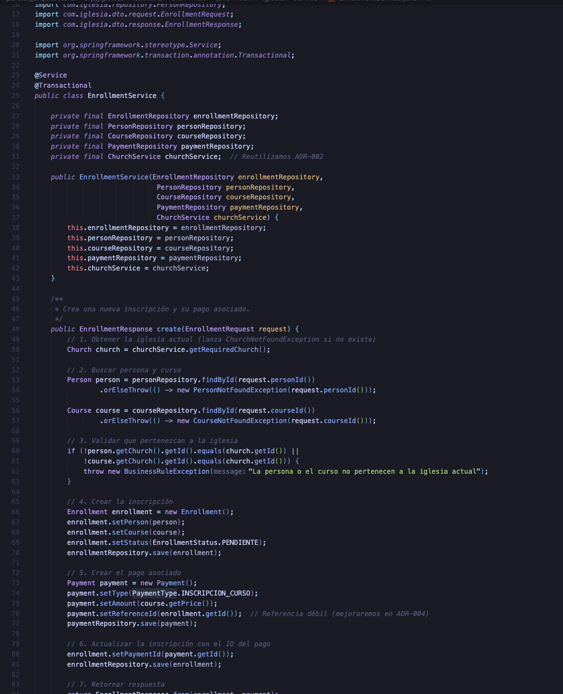
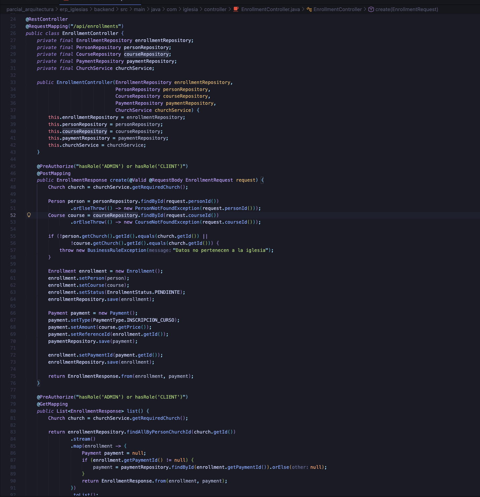
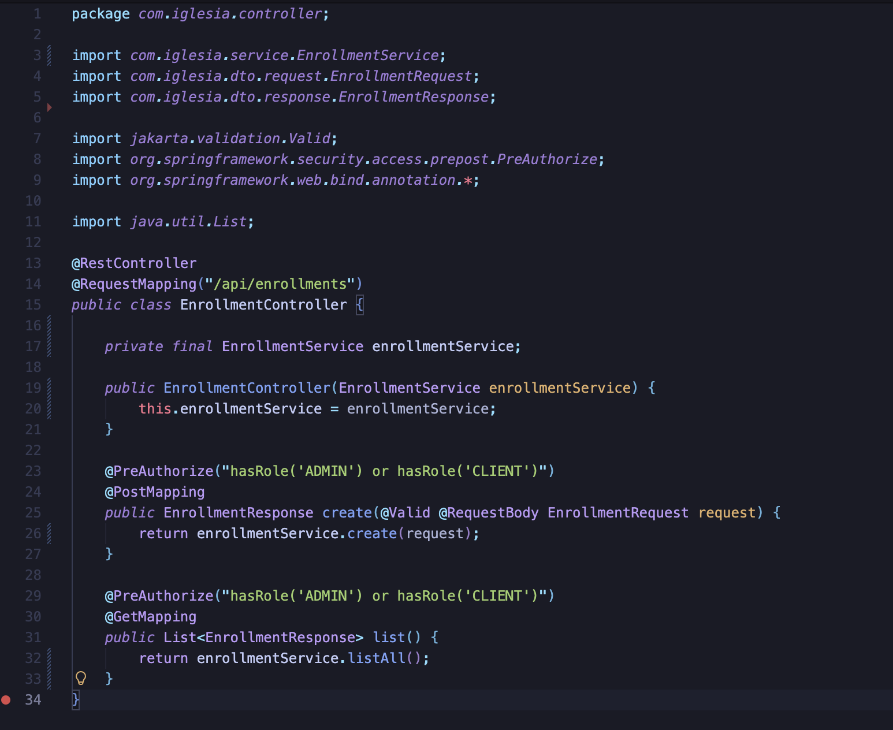
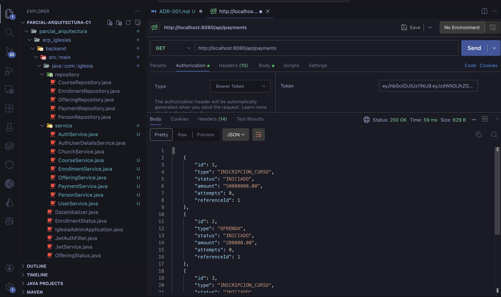

# Cambio 3 — ADR-001: Introducir Capa de Servicio (Service Layer Pattern)

## Información General

| Campo | Detalle |
|-------|---------|
| **ADR** | ADR-001 |
| **Patrón aplicado** | Service Layer Pattern |
| **Principio SOLID** | S — Single Responsibility Principle (SRP) |
| **Estado** | ✅ Implementado |

---

## Problema Identificado

Los controladores mezclaban **múltiples responsabilidades** en un solo método. Por ejemplo, `EnrollmentController.create()` realizaba en secuencia:

1. Obtención de la iglesia (`requireChurch()`)
2. Búsqueda y validación de `Person` por ID
3. Búsqueda y validación de `Course` por ID
4. Validación de pertenencia a la misma iglesia
5. Creación y persistencia de `Enrollment`
6. Creación y persistencia de `Payment`
7. Actualización de la referencia cruzada `enrollment.paymentId`
8. Construcción y retorno de `EnrollmentResponse`

**¿Por qué es un problema?**
- Viola **SRP**: el controlador tiene múltiples razones para cambiar.
- La lógica de negocio no es testeable sin levantar el contexto HTTP completo.
- Si la lógica de inscripción cambia, hay que buscarla dentro del controlador.
- Los repositorios están directamente acoplados al controlador.

---

## Archivos Modificados

### ✨ Servicios creados — paquete `service/`

| Archivo | Responsabilidad |
|---------|----------------|
| `EnrollmentService.java` | Lógica de creación y listado de inscripciones |
| `OfferingService.java` | Lógica de creación y listado de ofrendas |
| `PaymentService.java` | Lógica de confirmación, fallo y reintentos de pagos |
| `CourseService.java` | Lógica de creación, listado y búsqueda de cursos |
| `PersonService.java` | Lógica de creación y listado de personas |
| `UserService.java` | Lógica de creación de usuarios |
| `AuthService.java` | Lógica de autenticación y generación de token |

### ✏️ Controladores modificados

| Archivo | Cambio |
|---------|--------|
| `EnrollmentController.java` | Eliminada lógica de negocio, delega en `EnrollmentService` |
| `OfferingController.java` | Eliminada lógica de negocio, delega en `OfferingService` |
| `PaymentController.java` | Eliminada lógica de negocio, delega en `PaymentService` |
| `CourseController.java` | Eliminada lógica de negocio, delega en `CourseService` |
| `PersonController.java` | Eliminada lógica de negocio, delega en `PersonService` |
| `UserController.java` | Eliminada lógica de negocio, delega en `UserService` |
| `AuthController.java` | Eliminada lógica de negocio, delega en `AuthService` |

---

## Implementación

### Paso 1 — Estructura de paquetes creada

Se creó el paquete `service/` dentro de `backend/src/main/java/com/iglesia/`, con un servicio dedicado por cada dominio del sistema.

```
com/iglesia/
├── controller/
├── service/          ← ✨ NUEVO
│   ├── EnrollmentService.java
│   ├── OfferingService.java
│   ├── PaymentService.java
│   ├── CourseService.java
│   ├── PersonService.java
│   ├── UserService.java
│   └── AuthService.java
├── repository/
├── entity/
├── dto/
├── exception/
└── security/
```

---

### Paso 2 — Crear `EnrollmentService`

Se creó `EnrollmentService.java` anotado con `@Service` y `@Transactional`. Este servicio centraliza toda la lógica que antes vivía en el controlador: validaciones de negocio, creación de entidades y persistencia.



---

### Paso 3 — Modificar `EnrollmentController`

El controlador pasó de tener más de 30 líneas de lógica a simplemente **delegar** en el servicio.

**Antes** — controlador con lógica de negocio mezclada:



**Después** — controlador limpio, solo delega:



> El mismo patrón se aplicó en `OfferingController`, `PaymentController`, `CourseController`, `PersonController`, `UserController` y `AuthController`.

---

### Comparación de código — El cambio más representativo

**Antes** (`EnrollmentController.java` — más de 30 líneas mezclando responsabilidades):

```java
@PostMapping
public EnrollmentResponse create(@RequestBody EnrollmentRequest req) {
    Church church = requireChurch();                          // lógica de negocio
    Person person = personRepository.findById(req.personId())// acceso a datos
        .orElseThrow(() -> new ResponseStatusException(...));
    Course course = courseRepository.findById(req.courseId())// acceso a datos
        .orElseThrow(() -> new ResponseStatusException(...));
    if (!person.getChurch().getId().equals(church.getId()) ||// validación de negocio
        !course.getChurch().getId().equals(church.getId())) {
        throw new ResponseStatusException(BAD_REQUEST, "...");
    }
    Enrollment enrollment = new Enrollment();                // construcción de entidad
    enrollment.setPerson(person);
    enrollment.setCourse(course);
    enrollment.setStatus(EnrollmentStatus.PENDIENTE);
    enrollmentRepository.save(enrollment);
    Payment payment = new Payment();                         // creación de pago
    payment.setType(PaymentType.INSCRIPCION_CURSO);
    payment.setAmount(course.getPrice());
    payment.setReferenceId(enrollment.getId());
    paymentRepository.save(payment);
    enrollment.setPaymentId(payment.getId());
    enrollmentRepository.save(enrollment);
    return EnrollmentResponse.from(enrollment, payment);
}
```

**Después** (`EnrollmentController.java` — 3 líneas, responsabilidad única):

```java
@PostMapping
public EnrollmentResponse create(@Valid @RequestBody EnrollmentRequest req) {
    return enrollmentService.create(req);  // solo delega
}
```

```java
// EnrollmentService.java — aquí vive toda la lógica
@Service
@Transactional
public class EnrollmentService {
    public EnrollmentResponse create(EnrollmentRequest request) {
        Church church = churchService.getRequiredChurch();
        Person person = personRepository.findById(request.personId())
                .orElseThrow(() -> new PersonNotFoundException(request.personId()));
        Course course = courseRepository.findById(request.courseId())
                .orElseThrow(() -> new CourseNotFoundException(request.courseId()));
        if (!person.getChurch().getId().equals(church.getId()) ||
            !course.getChurch().getId().equals(church.getId())) {
            throw new BusinessRuleException("La persona o el curso no pertenecen a la iglesia actual");
        }
        Enrollment enrollment = new Enrollment();
        enrollment.setPerson(person);
        enrollment.setCourse(course);
        enrollment.setStatus(EnrollmentStatus.PENDIENTE);
        enrollmentRepository.save(enrollment);
        Payment payment = new Payment();
        payment.setType(PaymentType.INSCRIPCION_CURSO);
        payment.setAmount(course.getPrice());
        payment.setReferenceId(enrollment.getId());
        paymentRepository.save(payment);
        enrollment.setPaymentId(payment.getId());
        enrollmentRepository.save(enrollment);
        return EnrollmentResponse.from(enrollment, payment);
    }
}
```

---

## Pruebas Funcionales

Se verificó que **ningún endpoint fue afectado** por la refactorización. Las pruebas se realizaron con **Postman** confirmando que las respuestas son idénticas al comportamiento original.

---

### `GET /api/payments` — Lista de pagos

Se verificó que el endpoint de pagos retorna correctamente los datos después de mover la lógica a `PaymentService`.



---

## Resultado

| Aspecto | Antes | Después |
|---------|-------|---------|
| Líneas de lógica en `EnrollmentController.create()` | ~30 líneas | 1 línea (`return enrollmentService.create(req)`) |
| Repositorios inyectados en el controller | 3 repositorios | 0 repositorios |
| Lógica de negocio testeable sin HTTP | ❌ No | ✅ Sí |
| Lugar donde vive la lógica de negocio | Dentro del controller | `EnrollmentService`, `PaymentService`, etc. |
| Atomicidad de operaciones | Manual | `@Transactional` garantiza rollback automático |

---

## Consecuencias

**✅ Beneficios obtenidos:**
- Cumple **SRP**: cada controlador tiene una única razón para cambiar (cambios en HTTP)
- Los servicios son testeables de forma independiente sin necesidad de levantar el contexto HTTP
- `@Transactional` garantiza que si algo falla a mitad de una operación, todo se deshace automáticamente
- Los controladores son más pequeños, legibles y fáciles de entender
- La lógica de negocio es reutilizable entre controladores

**⚠️ Trade-offs:**
- Se crearon 7 archivos de servicio nuevos
- Se requirió refactorizar todos los controladores para inyectar los nuevos servicios
- El equipo debe entender la separación entre controller y service