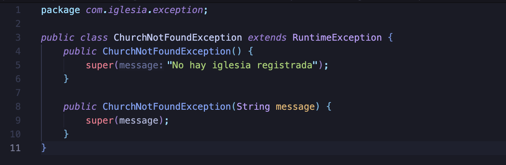
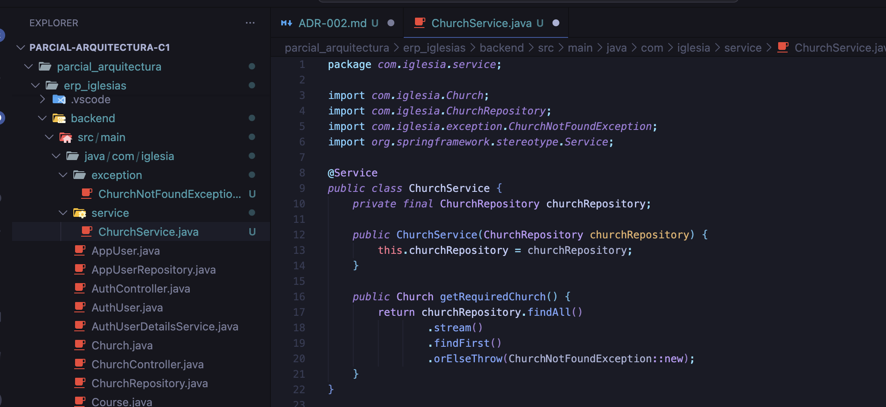
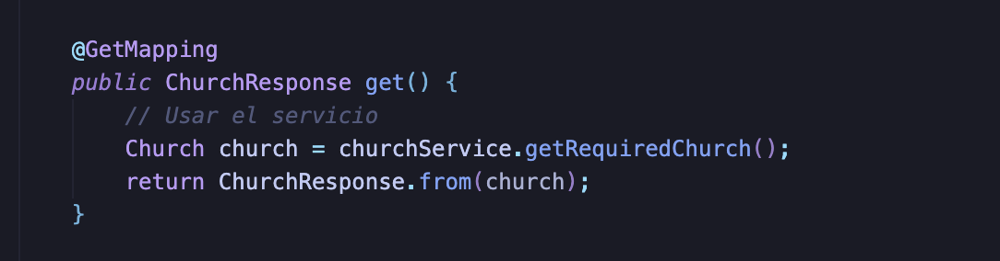
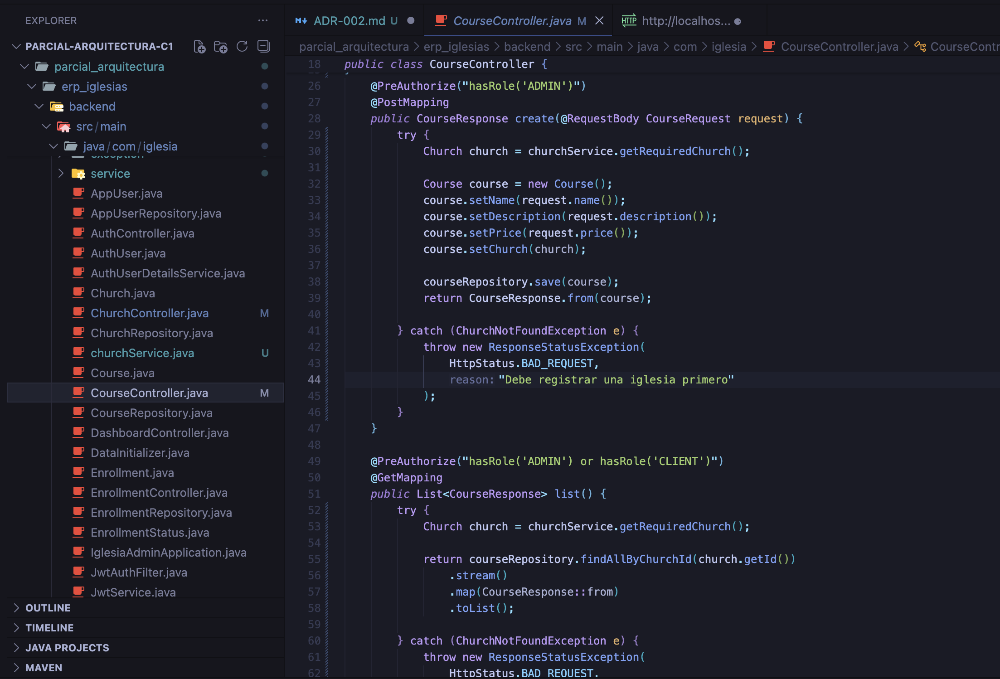
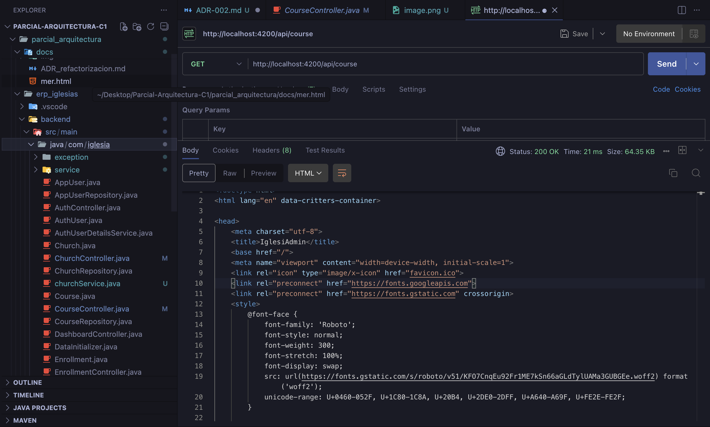
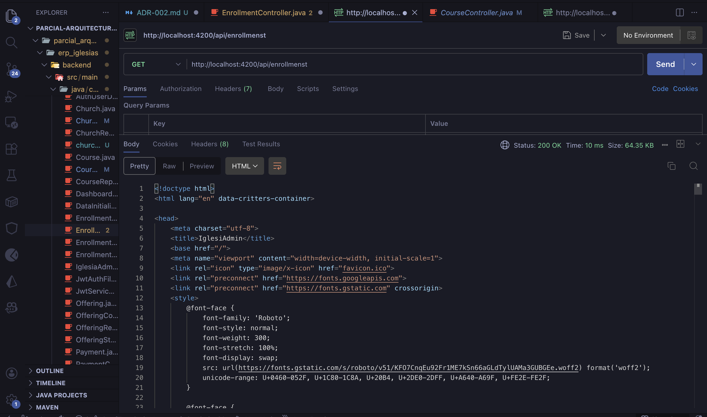
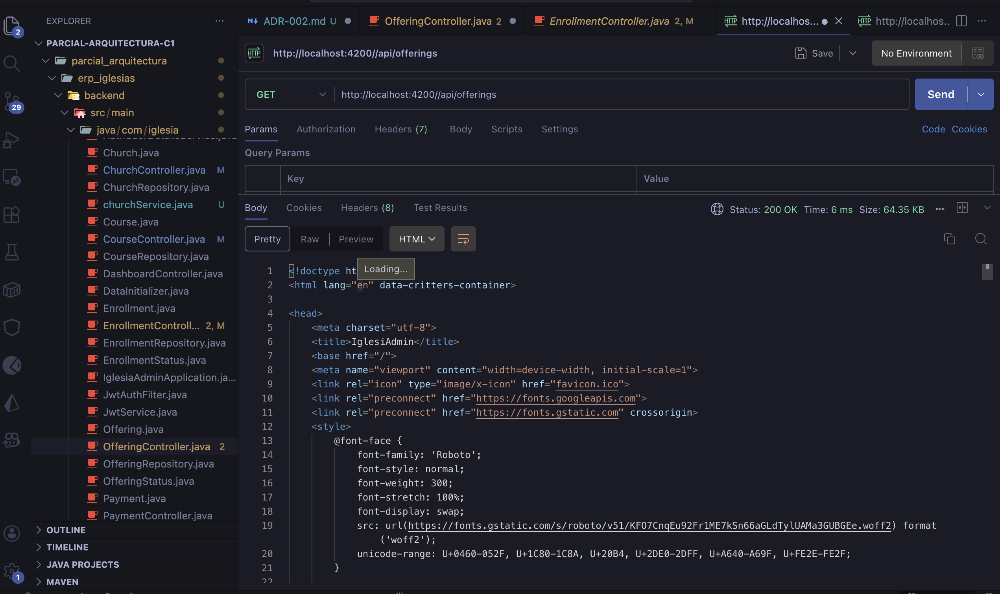
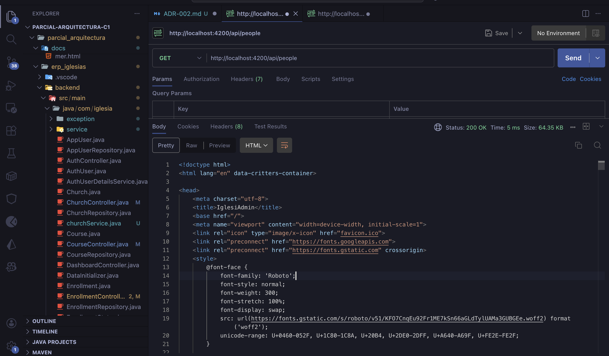
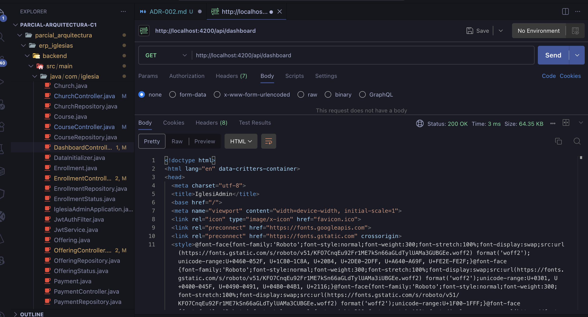

# Cambio 1 — ADR-002: ChurchService Singleton + DRY

## Información General

| Campo | Detalle |
|-------|---------|
| **ADR** | ADR-002 |
| **Patrón aplicado** | Singleton (Spring-managed) + DRY (Don't Repeat Yourself) |
| **Principio SOLID** | D — Dependency Inversion Principle |
| **Estado** | ✅ Implementado |

---

## Problema Identificado

El método `requireChurch()` estaba **duplicado de forma idéntica** en 5 controladores:

```java
// Código repetido en CourseController, EnrollmentController,
// OfferingController, PersonController y DashboardController
private Church requireChurch() {
    return churchRepository.findAll()
        .stream()
        .findFirst()
        .orElseThrow(() -> new ResponseStatusException(
            HttpStatus.BAD_REQUEST,
            "Debe registrar una iglesia primero"
        ));
}
```

**¿Por qué es un problema?**
- Si la lógica de búsqueda de la iglesia cambia, hay que modificar **5 archivos** distintos.
- Cualquier error en uno de ellos genera comportamientos inconsistentes.
- Viola el principio **DRY**: cada pieza de conocimiento debe existir una única vez.

---

## Archivos Modificados

| Archivo | Tipo de cambio |
|---------|---------------|
| `ChurchNotFoundException.java` | ✨ Creado — excepción de dominio |
| `ChurchService.java` | ✨ Creado — servicio centralizado |
| `ChurchController.java` | ✏️ Modificado — inyecta `ChurchService` |
| `CourseController.java` | ✏️ Modificado — elimina `requireChurch()`, inyecta `ChurchService` |
| `EnrollmentController.java` | ✏️ Modificado — ídem |
| `OfferingController.java` | ✏️ Modificado — ídem |
| `PersonController.java` | ✏️ Modificado — ídem |
| `DashboardController.java` | ✏️ Modificado — ídem |

---

## Implementación Paso a Paso

### Paso 1 — Crear la excepción de dominio `ChurchNotFoundException`

Se creó el paquete `exception` dentro de `backend/src/main/java/com/iglesia/` y se añadió la clase `ChurchNotFoundException.java`. Esto desacopla el manejo de errores de la capa HTTP (`ResponseStatusException`).



---

### Paso 2 — Crear `ChurchService`

Se creó `ChurchService.java` anotado con `@Service`. Spring lo gestiona automáticamente como **Singleton**: existe una única instancia compartida entre todos los controladores que lo inyectan. El método `getRequiredChurch()` centraliza la lógica que antes estaba duplicada.



---

### Paso 3 — Modificar `ChurchController`

Se reemplazó la inyección directa de `ChurchRepository` por `ChurchService`. El método `get()` ahora usa `churchService.getRequiredChurch()`, lo que elimina el acceso directo al repositorio desde el controlador.

**Cambios aplicados:**
- ✅ Inyecta `ChurchService` en lugar de `ChurchRepository`
- ✅ El método `get()` usa `churchService.getRequiredChurch()`



---

### Paso 4 — Modificar `CourseController`

Se eliminó el método privado `requireChurch()` y se inyectó `ChurchService` en el constructor. Las llamadas a `requireChurch()` fueron reemplazadas por `churchService.getRequiredChurch()`.

**Cambios aplicados:**
- ✅ Eliminado método `requireChurch()` (ya no es necesario)
- ✅ Inyectado `ChurchService` en el constructor
- ✅ Reemplazadas todas las llamadas a `requireChurch()` por `churchService.getRequiredChurch()`



> Los mismos 3 cambios se aplicaron de forma idéntica en `EnrollmentController`, `OfferingController`, `PersonController` y `DashboardController`.

---

## Pruebas Funcionales

Se verificó que **ningún endpoint existente fue afectado** después de los cambios. Las pruebas se realizaron con **Postman** comprobando que las respuestas son idénticas al comportamiento original.

---

### `CourseController` — `GET /api/courses`

Se verificó que la lista de cursos se retorna correctamente después de eliminar `requireChurch()` del controlador.



---

### `EnrollmentController` — `GET /api/enrollments`

Se verificó que la lista de inscripciones se retorna correctamente.



---

### `OfferingController` — `GET /api/offerings`

Se verificó que la lista de ofrendas se retorna correctamente.



---

### `PersonController` — `GET /api/people`

Se verificó que la lista de personas se retorna correctamente.



---

### `DashboardController` — `GET /api/dashboard`

Se verificó que las métricas del dashboard se retornan correctamente.



---

## Resultado

| Aspecto | Antes | Después |
|---------|-------|---------|
| Número de veces que existía `requireChurch()` | 5 copias idénticas | 1 método en `ChurchService` |
| Archivos a modificar si cambia la lógica | 5 archivos | 1 archivo (`ChurchService`) |
| Manejo de excepción | `ResponseStatusException` acoplada a HTTP | `ChurchNotFoundException` de dominio |
| Gestión de instancia | Cada controller creaba su propia lógica | Spring gestiona una única instancia (Singleton) |

---

## Consecuencias

**✅ Beneficios obtenidos:**
- Se eliminó la duplicación de código en 5 controladores (principio **DRY**)
- El patrón **Singleton** de Spring garantiza una única instancia de `ChurchService` en toda la aplicación
- Si la lógica de obtención de la iglesia cambia, solo se modifica `ChurchService.java`
- La excepción `ChurchNotFoundException` desacopla la lógica de negocio de la capa HTTP

**⚠️ Trade-offs:**
- Se requirió un pequeño refactor en 5 controladores para inyectar el nuevo servicio
- Se crearon 2 archivos nuevos (`ChurchService.java` y `ChurchNotFoundException.java`)