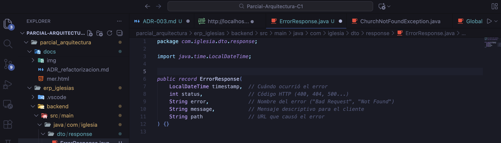
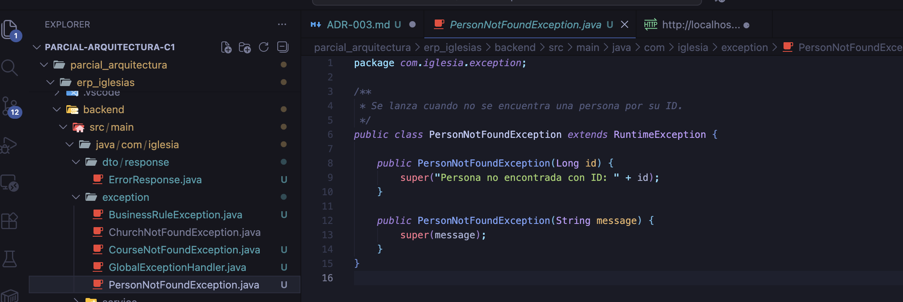
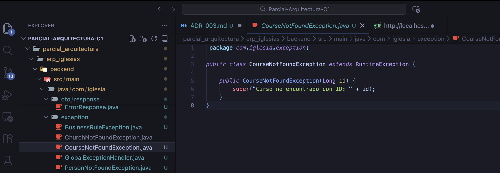
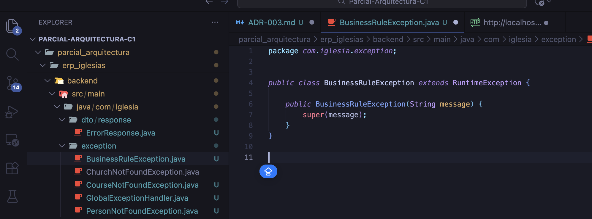
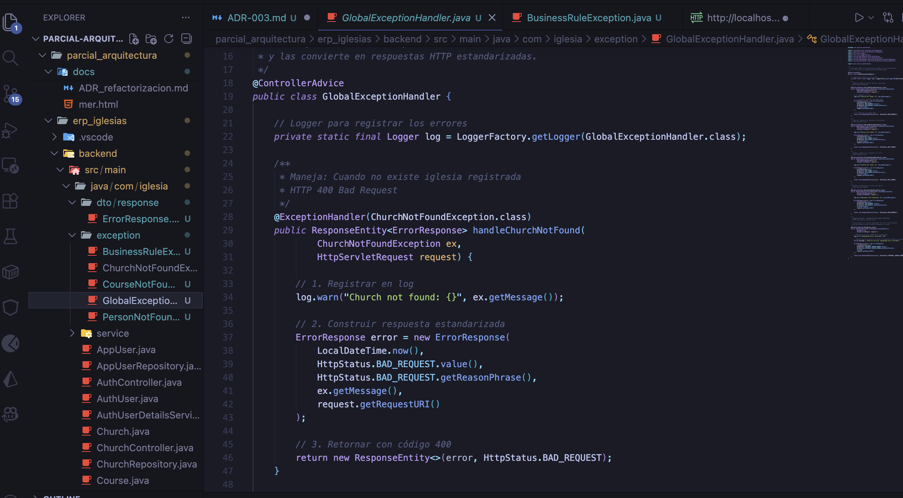
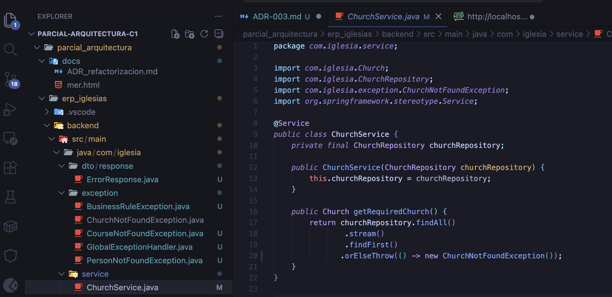

# Cambio 3 — ADR-003: GlobalExceptionHandler

Archivos modificados:

✨ GlobalExceptionHandler.java
✨ ErrorResponse.java
✨ ChurchNotFoundException.java
✨ PersonNotFoundException.java

Paso 1: Crear la estructura de paquetes
Primero, necesitamos organizar nuestro código. Crea estas carpetas:

text
com/iglesia/
├── exception/        ← Aquí irán nuestras excepciones personalizadas
│   └── (vacío por ahora)
├── dto/              ← Para los DTOs (objetos de transferencia)
│   └── response/     ← Respuestas de la API
│       └── (vacío)
¿Por qué?

exception/: agrupa todas las clases relacionadas con manejo de errores

dto/response/: contiene los objetos que devolvemos al cliente

Paso 2: Crear el DTO de respuesta de error

Crea un archivo llamado ErrorResponse.java 

Paso 3: Crear excepciones personalizadas
Ahora vamos a crear excepciones ESPECÍFICAS para cada error de negocio. Crea estos archivos en com.iglesia.exception:

La de ChurchNotFoundException.java ya lo habiamos hecho en el ADR-002
 SE CREO UNO PARA CADA UNO DE ESTOS : 

 PersonNotFoundException.java

en CourseNotFoundException.java : 

Y SE CREO ESTE PARA: BusinessRuleException.java (para reglas de negocio)

Paso 4: Crear el manejador global de excepciones
Este es el corazón del ADR-003. Crea GlobalExceptionHandler.java en com.iglesia.exception

Paso 5: Modificar el ChurchService para usar las nuevas excepciones
Actualiza ChurchService.java para que lance ChurchNotFoundException en lugar de ResponseStatusException:

Paso 6: Modificar los controladores
Ahora, en TODOS los controladores, reemplazamos ResponseStatusException por NUESTRAS excepciones. Mira el ejemplo con CourseController:

