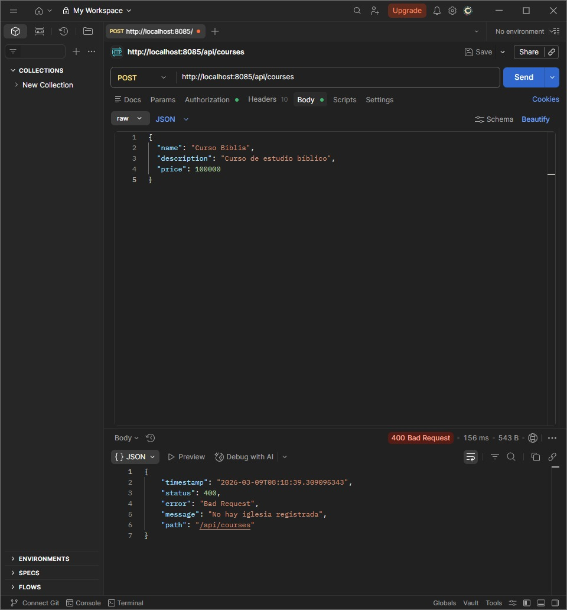

# Cambio 5 — ADR-003: Global Exception Handler con @ControllerAdvice

## Información General

| Campo | Detalle |
|-------|---------|
| **ADR** | ADR-003 |
| **Patrón aplicado** | Facade Pattern + Centralized Exception Handling |
| **Principio SOLID** | O — Open/Closed Principle (OCP) + S — Single Responsibility Principle |
| **Estado** | ✅ Implementado |

---

## Problema Identificado

En el sistema original, cada controlador manejaba sus propios errores lanzando `ResponseStatusException` directamente con mensajes hardcodeados:

```java
// ❌ ANTES — error HTTP acoplado al controlador
throw new ResponseStatusException(
    HttpStatus.NOT_FOUND,
    "Curso no encontrado"
);
```

**¿Por qué es un problema?**
- Cada controlador manejaba errores de forma **diferente** — sin formato estándar.
- La lógica HTTP estaba **mezclada** con la lógica de negocio.
- Las respuestas de error **no tenían un formato consistente** para el cliente.
- **Duplicación de código**: el mismo patrón de manejo de error repetido en múltiples controladores.
- Viola **OCP**: si se quiere cambiar el formato de respuesta de error, hay que modificar todos los controladores.

---

## Archivos Modificados

| Archivo | Tipo de cambio |
|---------|---------------|
| `dto/response/ErrorResponse.java` |  Creado — DTO estándar de respuesta de error |
| `exception/ChurchNotFoundException.java` |  Creado — excepción de dominio |
| `exception/PersonNotFoundException.java` |  Creado — excepción de dominio |
| `exception/CourseNotFoundException.java` |  Creado — excepción de dominio |
| `exception/BusinessRuleException.java` |  Creado — excepción de reglas de negocio |
| `exception/GlobalExceptionHandler.java` | Creado — manejador global centralizado |
| `service/ChurchService.java` |  Modificado — usa `ChurchNotFoundException` |
| `controller/CourseController.java` |  Modificado — usa `CourseNotFoundException` |
| `controller/PersonController.java` |  Modificado — usa `PersonNotFoundException` |

---

## Implementación

### Paso 1 — Estructura de paquetes creada

Se crearon los paquetes `exception/` y `dto/response/` dentro de `com/iglesia/` para organizar las excepciones personalizadas y el DTO de error.


---

### Paso 2 — Crear `ErrorResponse` — el formato estándar

Se creó `ErrorResponse.java` como el DTO que define la estructura uniforme para **todas** las respuestas de error de la API. Antes cada error se veía diferente; ahora siempre retorna el mismo formato JSON:

```json
{
  "timestamp": "2026-03-08T21:00:00",
  "status": 404,
  "error": "Not Found",
  "message": "Curso no encontrado con ID: 99",
  "path": "/api/courses/99"
}
```

---

### Paso 3 — Crear excepciones personalizadas de dominio

Se crearon excepciones específicas para cada error del dominio, ubicadas en `com.iglesia.exception`. Estas excepciones **desacoplan la lógica de negocio de la capa HTTP** — el controlador ya no necesita saber qué código HTTP corresponde a cada error.

#### `PersonNotFoundException`

Se lanza cuando una persona solicitada no existe en el sistema.


---

#### `CourseNotFoundException`

Se lanza cuando un curso solicitado no existe.


---

#### `BusinessRuleException`

Se utiliza para representar violaciones de reglas de negocio, como intentar registrar una iglesia cuando ya existe una, o inscribir una persona en un curso de otra iglesia.


---

### Paso 4 — Crear `GlobalExceptionHandler`

Se creó la clase `GlobalExceptionHandler.java` anotada con `@RestControllerAdvice`. Esta anotación le indica a Spring que **intercepte todas las excepciones** lanzadas en cualquier controlador y las convierta en respuestas HTTP estandarizadas.

**¿Por qué cumple OCP?** Agregar soporte para un nuevo tipo de excepción = agregar un nuevo método `@ExceptionHandler`. No se modifica código existente.

```java
@RestControllerAdvice
public class GlobalExceptionHandler {

    @ExceptionHandler(CourseNotFoundException.class)
    public ResponseEntity<ErrorResponse> handleCourseNotFound(
            CourseNotFoundException ex, HttpServletRequest request) {
        return ResponseEntity.status(HttpStatus.NOT_FOUND)
            .body(new ErrorResponse(
                LocalDateTime.now(), 404, "Not Found",
                ex.getMessage(), request.getRequestURI()
            ));
    }

    // Un método por cada tipo de excepción — abierto a extensión, cerrado a modificación
    @ExceptionHandler(BusinessRuleException.class)
    public ResponseEntity<ErrorResponse> handleBusinessRule(...) { ... }

    @ExceptionHandler(Exception.class)  // red de seguridad — cualquier error inesperado
    public ResponseEntity<ErrorResponse> handleGeneric(...) { ... }
}
```


---

### Paso 5 — Modificar `ChurchService`

Se reemplazó `ResponseStatusException` por la excepción de dominio `ChurchNotFoundException`, desacoplando la capa de negocio de la capa HTTP.

**Antes:**
```java
// ❌ La capa de negocio conoce códigos HTTP
throw new ResponseStatusException(
    HttpStatus.BAD_REQUEST,
    "Debe registrar una iglesia primero"
);
```

**Después:**
```java
// ✅ La capa de negocio solo lanza su excepción de dominio
throw new ChurchNotFoundException(
    "Debe registrar una iglesia primero"
);
// GlobalExceptionHandler se encarga del código HTTP
```


> El mismo cambio se aplicó en `CourseController` y `PersonController`, reemplazando `ResponseStatusException` por `CourseNotFoundException` y `PersonNotFoundException` respectivamente.

---

## Pruebas Funcionales

Se verificó con **Postman** que el sistema responde con el formato estándar ante errores, en lugar del texto plano que retornaba antes.

---

### `GET /api/courses/{id}` — Curso no encontrado

Se realizó una petición con un ID que no existe en la base de datos. El sistema retorna el error en formato JSON estandarizado con el `GlobalExceptionHandler`.

**Antes** — respuesta inconsistente:
```
404 Not Found — texto plano sin estructura
```

**Después** — respuesta estandarizada:
```json
{
  "timestamp": "2026-03-08T21:00:00",
  "status": 404,
  "error": "Not Found",
  "message": "Curso no encontrado con ID: 99",
  "path": "/api/courses/99"
}
```



---

## Resultado

| Aspecto | Antes | Después |
|---------|-------|---------|
| Manejo de errores | Distribuido en cada controlador | Centralizado en `GlobalExceptionHandler` |
| Formato de respuesta de error | Inconsistente entre endpoints | Uniforme: `timestamp`, `status`, `error`, `message`, `path` |
| Acoplamiento HTTP en negocio | Alto — servicios conocen `HttpStatus` | Bajo — servicios solo lanzan excepciones de dominio |
| Agregar nuevo tipo de error | Modificar el controlador afectado | Agregar un método en `GlobalExceptionHandler` |
| Logging de errores | Sin registro centralizado | `log.warn` y `log.error` centralizados |

---

## Consecuencias

**✅ Beneficios obtenidos:**
- **Un solo lugar** para manejar todos los errores del sistema
- Todas las respuestas de error tienen un **formato JSON uniforme**
- La lógica de negocio está **desacoplada** de la capa HTTP
- Cumple **OCP**: agregar nueva excepción = nuevo método, sin tocar los existentes
- Los controladores quedaron más **limpios y enfocados** en su responsabilidad

**⚠️ Trade-offs:**
- Se crearon 6 archivos nuevos (excepciones + handler + ErrorResponse)
- El `GlobalExceptionHandler` debe mantenerse actualizado cuando se agreguen nuevas excepciones al sistema