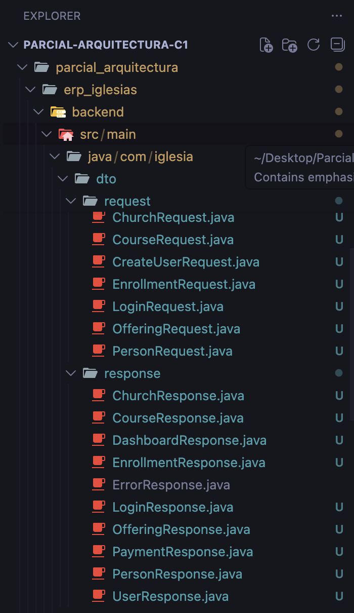
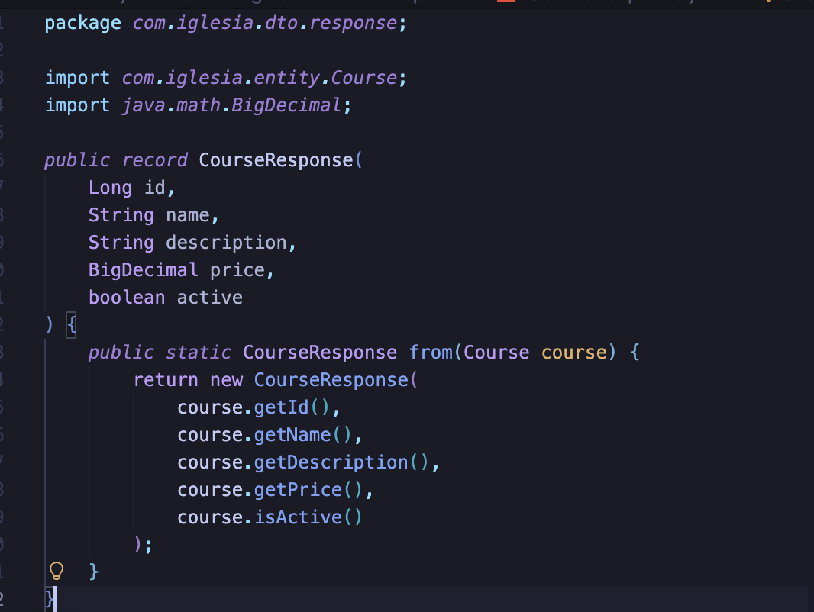
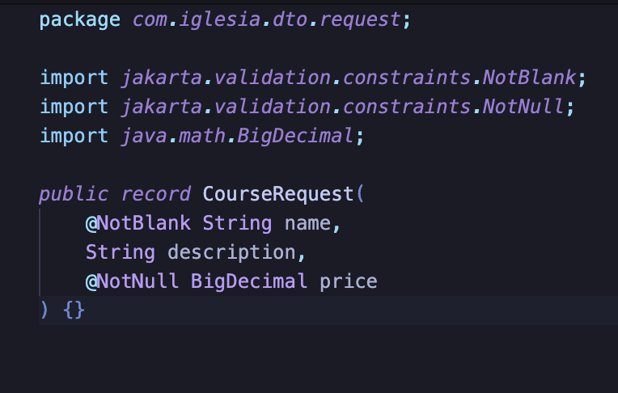
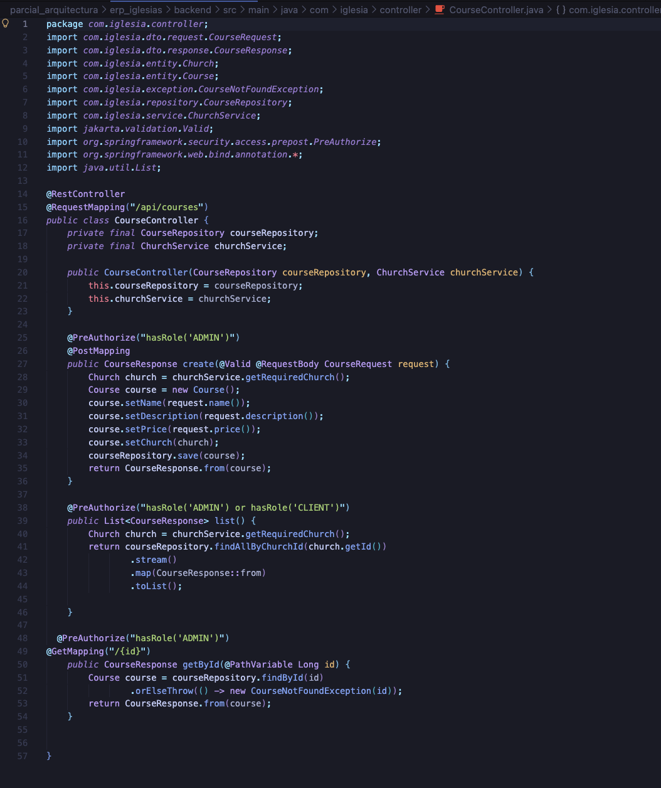
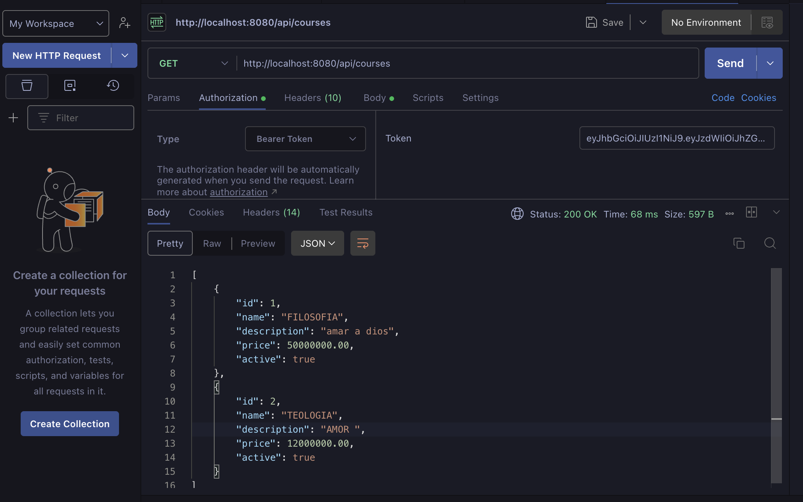
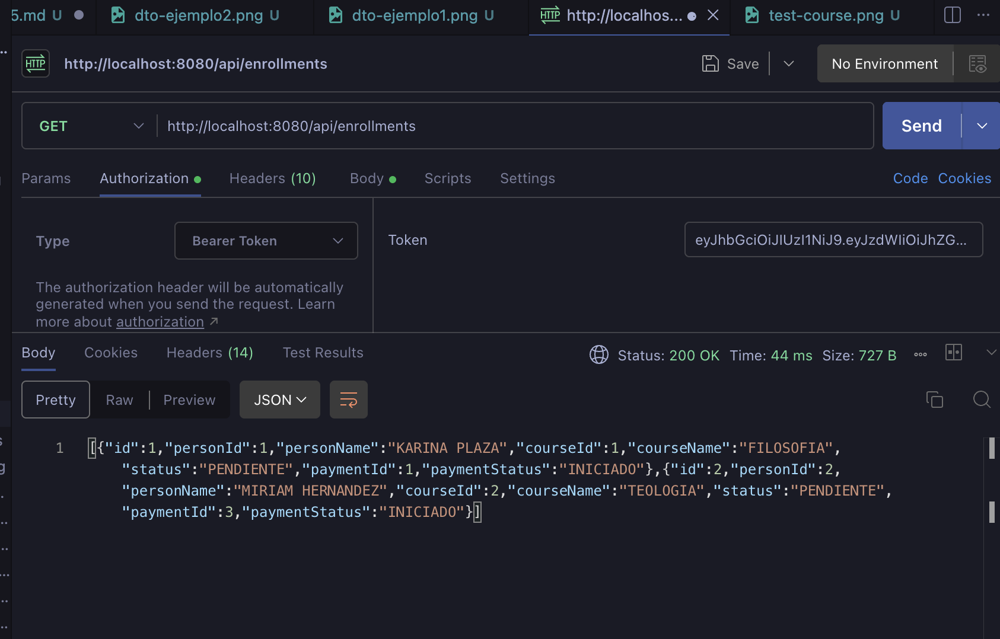

# Cambio 2 — ADR-005: Separar DTOs de los Controladores

## Información General

| Campo | Detalle |
|-------|---------|
| **ADR** | ADR-005 |
| **Patrón aplicado** | DTO Pattern (Data Transfer Object) |
| **Principio SOLID** | S — Single Responsibility Principle |
| **Estado** | ✅ Implementado |

---

## Problema Identificado

Los records que definen la estructura de los datos (`LoginRequest`, `CourseRequest`, `CourseResponse`, `EnrollmentResponse`, etc.) estaban definidos como **clases internas** dentro de cada controlador. Por ejemplo, `CourseController` contenía sus propios DTOs al final del archivo:

```java
// ❌ ANTES — DTOs acoplados al controlador
public class CourseController {

    // ... lógica del controlador ...

    // DTOs internos — no reutilizables desde otros lugares
    public record CourseRequest(
        @NotBlank String name,
        String description,
        @NotNull BigDecimal price
    ) {}

    public record CourseResponse(
        Long id, String name, String description,
        BigDecimal price, boolean active
    ) {
        public static CourseResponse from(Course course) { ... }
    }
}
```

**¿Por qué es un problema?**
- Un servicio que necesite `CourseRequest` debe importar todo `CourseController` para usarlo.
- Viola **SRP**: el controlador tiene responsabilidad sobre la estructura de datos Y sobre el manejo HTTP.
- Si dos controladores necesitan el mismo DTO, hay que duplicarlo.
- Dificulta encontrar y mantener los DTOs cuando el proyecto crece.

---

## Archivos Modificados

### ✨ Archivos creados — paquete `dto/request/`

| Archivo | Contenido |
|---------|-----------|
| `LoginRequest.java` | Email y password para autenticación |
| `ChurchRequest.java` | Nombre y dirección de la iglesia |
| `CourseRequest.java` | Nombre, descripción y precio del curso |
| `PersonRequest.java` | Datos personales (nombre, documento, teléfono, email) |
| `EnrollmentRequest.java` | ID de persona e ID de curso |
| `OfferingRequest.java` | ID de persona, monto y concepto |
| `CreateUserRequest.java` | Email y contraseña para crear usuario |

### ✨ Archivos creados — paquete `dto/response/`

| Archivo | Contenido |
|---------|-----------|
| `LoginResponse.java` | Token JWT, email y rol |
| `ChurchResponse.java` | ID, nombre y dirección |
| `CourseResponse.java` | ID, nombre, descripción, precio y estado activo |
| `PersonResponse.java` | ID y datos personales completos |
| `EnrollmentResponse.java` | ID, datos de persona, curso, estado y pago |
| `OfferingResponse.java` | ID, datos de persona, concepto, monto y estado |
| `PaymentResponse.java` | ID, tipo, estado, monto, intentos y referencia |
| `UserResponse.java` | ID, email y rol |
| `DashboardResponse.java` | Métricas: personas, cursos, ofrendas, pagos pendientes |
| `ErrorResponse.java` | Formato estándar de errores (usado por ADR-003) |

### ✏️ Controladores modificados

| Archivo | Cambio |
|---------|--------|
| `AuthController.java` | Eliminados `LoginRequest` y `LoginResponse` internos |
| `ChurchController.java` | Eliminados `ChurchRequest` y `ChurchResponse` internos |
| `CourseController.java` | Eliminados `CourseRequest` y `CourseResponse` internos |
| `PersonController.java` | Eliminados `PersonRequest` y `PersonResponse` internos |
| `EnrollmentController.java` | Eliminados `EnrollmentRequest` y `EnrollmentResponse` internos |
| `OfferingController.java` | Eliminados `OfferingRequest` y `OfferingResponse` internos |
| `PaymentController.java` | Eliminado `PaymentResponse` interno |
| `UserController.java` | Eliminados `CreateUserRequest` y `UserResponse` internos |

---

## Implementación

### Paso 1 — Estructura de paquetes creada

Se crearon las carpetas `dto/request/` y `dto/response/` dentro de `backend/src/main/java/com/iglesia/`, organizando todos los DTOs por su dirección de flujo (entrada vs salida).



---

### Paso 2 — DTOs movidos a sus propios archivos

Cada DTO pasó de ser una clase interna a ser un archivo independiente con su propio paquete. Aquí un ejemplo con `CourseRequest` y `CourseResponse`:

 --

 -


---

### Paso 3 — Controladores actualizados

Se eliminaron todos los records internos de los controladores y se reemplazaron por imports desde los nuevos paquetes. El controlador quedó enfocado únicamente en su responsabilidad: recibir peticiones HTTP y devolver respuestas.




> El mismo patrón se aplicó en los 7 controladores restantes: `AuthController`, `ChurchController`, `PersonController`, `EnrollmentController`, `OfferingController`, `PaymentController` y `UserController`.

---

## Pruebas Funcionales

Se verificó que **ningún endpoint fue afectado** por el cambio. Las pruebas se realizaron con **Postman** confirmando que las respuestas son idénticas al comportamiento original.

---

### `GET /api/courses` — Lista de cursos

Se verificó que el endpoint retorna correctamente la lista de cursos con la misma estructura JSON de antes.



---

### `GET /api/enrollments` — Lista de inscripciones

Se verificó que el endpoint retorna correctamente las inscripciones con todos los campos esperados.



---

## Resultado

| Aspecto | Antes | Después |
|---------|-------|---------|
| Ubicación de los DTOs | Clases internas de cada controller | Paquetes `dto/request/` y `dto/response/` |
| Reutilización | Imposible sin importar el controller completo | Cualquier clase puede importar el DTO directamente |
| Archivos de DTOs independientes | 0 | 17 archivos organizados |
| Responsabilidad del controller | HTTP + estructura de datos | Solo HTTP |
| Tiempo para encontrar un DTO | Buscar dentro del controller correcto | Buscar en `dto/request/` o `dto/response/` |

---

## Consecuencias

**✅ Beneficios obtenidos:**
- Cumple **SRP**: cada controlador ahora tiene una única responsabilidad (manejar HTTP)
- Los DTOs son **reutilizables** entre controladores y servicios
- La estructura del proyecto es más **navegable**: todos los DTOs están en un solo lugar
- Facilita la **sincronización con el frontend**: los modelos están centralizados

**⚠️ Trade-offs:**
- Se actualizaron los imports en 8 controladores
- Se crearon 17 archivos nuevos (automatizable con herramientas del IDE)