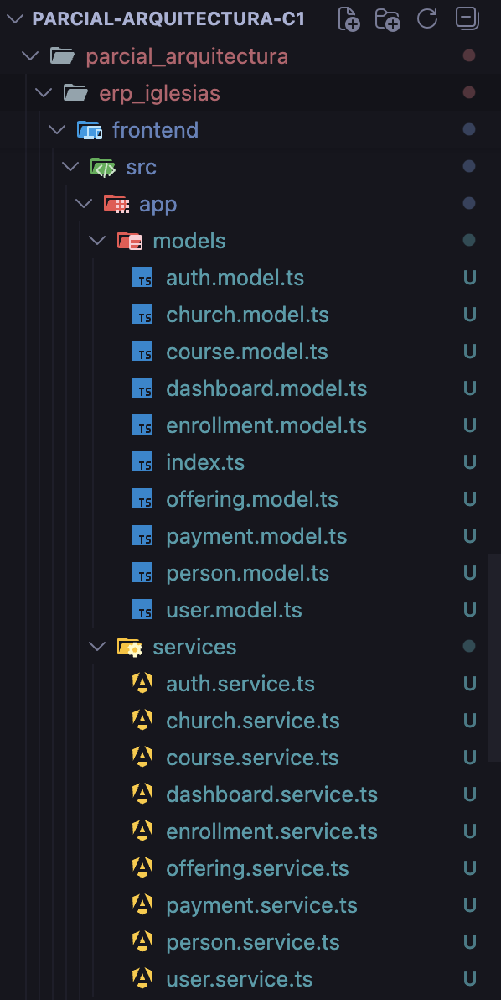
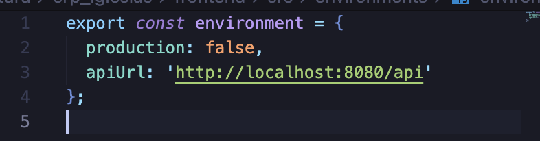
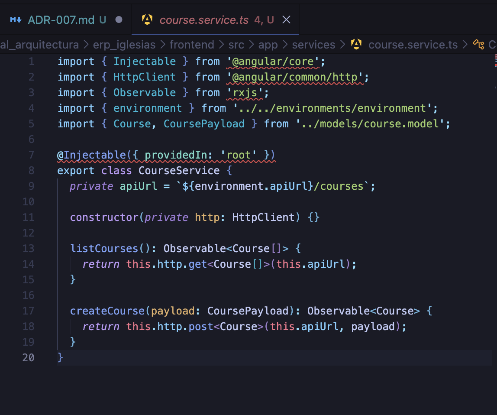
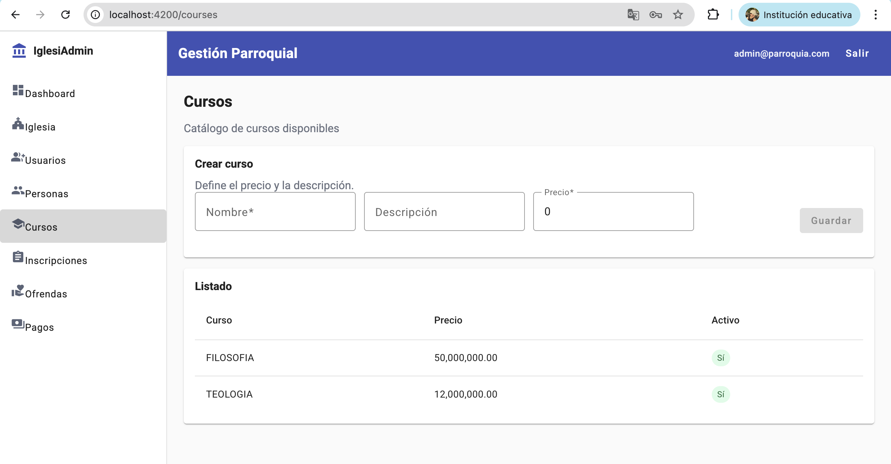
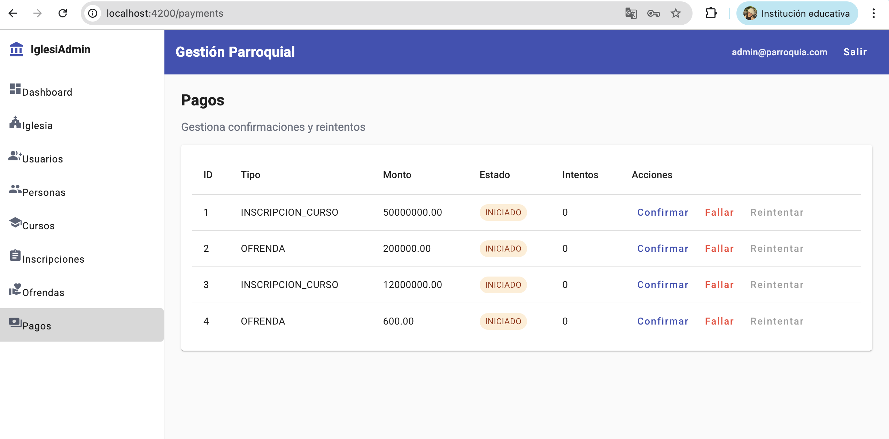

# Cambio 4 — ADR-007: Separar ApiService en Servicios por Dominio

## Información General

| Campo | Detalle |
|-------|---------|
| **ADR** | ADR-007 |
| **Patrón aplicado** | Service Layer Pattern |
| **Principio SOLID** | S — Single Responsibility Principle (SRP) + DRY |
| **Estado** | ✅ Implementado |

---

## Problema Identificado

El archivo `api.service.ts` era un servicio **monolítico** que concentraba absolutamente todos los métodos HTTP del frontend: login, iglesia, personas, cursos, inscripciones, ofrendas, pagos y dashboard. Además, contenía todas las interfaces de dominio al final del archivo.

**¿Por qué es un problema?**
- Viola **SRP**: un solo archivo tenía responsabilidad sobre todos los dominios del sistema.
- La URL base estaba **hardcodeada** directamente en el servicio.
- Un componente que solo necesitaba listar cursos debía inyectar todo `ApiService` con los 20+ métodos.
- Si se agrega un nuevo módulo, el archivo crecía indefinidamente.
- Las interfaces de dominio estaban acopladas al servicio HTTP, impidiendo su reutilización.

---

## Archivos Modificados

### ✨ Modelos creados — carpeta `models/`

| Archivo | Interfaces exportadas |
|---------|----------------------|
| `auth.model.ts` | `LoginResponse` |
| `church.model.ts` | `Church` |
| `user.model.ts` | `User` |
| `person.model.ts` | `Person`, `PersonPayload` |
| `course.model.ts` | `Course`, `CoursePayload` |
| `enrollment.model.ts` | `Enrollment`, `EnrollmentPayload` |
| `offering.model.ts` | `Offering`, `OfferingPayload` |
| `payment.model.ts` | `Payment` |
| `dashboard.model.ts` | `Dashboard` |
| `index.ts` | Barrel — exporta todos los modelos |

### ✨ Servicios creados — carpeta `services/`

| Archivo | Responsabilidad |
|---------|----------------|
| `auth.service.ts` | Login y autenticación |
| `church.service.ts` | Obtener y crear iglesia |
| `user.service.ts` | Crear usuarios |
| `person.service.ts` | Listar y crear personas |
| `course.service.ts` | Listar y crear cursos |
| `enrollment.service.ts` | Listar y crear inscripciones |
| `offering.service.ts` | Listar y crear ofrendas |
| `payment.service.ts` | Listar, confirmar, fallar y reintentar pagos |
| `dashboard.service.ts` | Obtener métricas del dashboard |

###  Archivos modificados

| Archivo | Cambio |
|---------|--------|
| `environments/environment.ts` | Agregada `apiUrl` centralizada |
| `courses.component.ts` | Reemplazado `ApiService` por `CourseService` |
| `people.component.ts` | Reemplazado `ApiService` por `PersonService` |
| `enrollments.component.ts` | Reemplazado `ApiService` por `EnrollmentService` |
| `offerings.component.ts` | Reemplazado `ApiService` por `OfferingService` |
| `payments.component.ts` | Reemplazado `ApiService` por `PaymentService` |
| `dashboard.component.ts` | Reemplazado `ApiService` por `DashboardService` |
| `login.component.ts` | Reemplazado `ApiService` por `AuthService` |
| `church.component.ts` | Reemplazado `ApiService` por `ChurchService` |

---

## Implementación

### Paso 1 — Estructura de carpetas creada

Se crearon las carpetas `services/` y `models/` dentro de `frontend/src/app/`, separando las interfaces de dominio de los servicios HTTP.



---

### Paso 2 — URL base centralizada en `environment.ts`

Se definió `apiUrl` en el archivo de entorno. Ahora todos los servicios toman la URL desde un único lugar — si cambia el host o el puerto, solo se modifica `environment.ts`.



---

### Paso 3 — `ApiService` monolítico reemplazado por servicios por dominio

 Antes teniamos `api.service.ts` con todos los métodos mezclados y URL hardcodeada


**Después** — `course.service.ts` con responsabilidad única:



---

### Comparación de código — El cambio más representativo

**Antes** (`api.service.ts` — todos los dominios en un solo archivo):

```typescript
@Injectable({ providedIn: 'root' })
export class ApiService {
  private baseUrl = 'http://localhost:8080/api';  // ← URL hardcodeada

  login(email: string, password: string): Observable<any> {
    return this.http.post<any>(`${this.baseUrl}/auth/login`, { email, password });
  }
  getChurch(): Observable<any> { ... }
  listPeople(): Observable<any[]> { ... }
  listCourses(): Observable<any[]> { ... }
  // 15+ métodos más de todos los dominios mezclados...
}
```

**Después** (`course.service.ts` — responsabilidad única):

```typescript
@Injectable({ providedIn: 'root' })
export class CourseService {
  private apiUrl = `${environment.apiUrl}/courses`;  // ← URL desde environment

  constructor(private http: HttpClient) {}

  listCourses(): Observable<Course[]> {
    return this.http.get<Course[]>(this.apiUrl);
  }

  createCourse(payload: CoursePayload): Observable<Course> {
    return this.http.post<Course>(this.apiUrl, payload);
  }
}
```

---

### Paso 4 — Componentes actualizados

Cada componente fue actualizado para inyectar únicamente el servicio que necesita.

**Antes:**
```typescript
import { ApiService } from './api.service';

constructor(private api: ApiService) {}

load() {
  this.api.listCourses().subscribe(...);  // depende de todo ApiService
}
```

**Después:**
```typescript
import { CourseService } from '../services/course.service';

constructor(private courseService: CourseService) {}

load() {
  this.courseService.listCourses().subscribe(...);  // solo depende de CourseService
}
```


---

## Pruebas Funcionales

Se verificó que **todas las vistas del frontend siguen funcionando** correctamente después del cambio. Las pruebas se realizaron directamente en el navegador confirmando que los datos cargan igual que antes.

---

### Vista de Cursos

Se verificó que la lista de cursos carga correctamente consumiendo `CourseService` en lugar de `ApiService`.



---

### Vista de Pagos

Se verificó que la vista de pagos carga y permite confirmar pagos correctamente consumiendo `PaymentService`.



---

## Resultado

| Aspecto | Antes | Después |
|---------|-------|---------|
| Archivos de servicios | 1 archivo (`api.service.ts`) | 9 servicios especializados |
| Métodos por archivo | 20+ métodos mezclados | 2-4 métodos por servicio |
| URL base | Hardcodeada en `api.service.ts` | Centralizada en `environment.ts` |
| Tipado de respuestas | `any` y `any[]` | Interfaces tipadas (`Course[]`, `Payment`, etc.) |
| Lo que inyecta un componente | Todo `ApiService` | Solo el servicio que necesita |
| Interfaces de dominio | Dentro de `api.service.ts` | Carpeta `models/` independiente |

---

## Consecuencias

**✅ Beneficios obtenidos:**
- Cumple **SRP**: cada servicio tiene una única razón para cambiar
- La URL base está en un **único lugar** (`environment.ts`) — fácil de cambiar entre entornos
- Los componentes son más simples: inyectan solo lo que necesitan
- Las interfaces de dominio son **reutilizables** desde cualquier parte del frontend
- Tipado fuerte: se eliminaron los `any` por interfaces concretas

**⚠️ Trade-offs:**
- Se crearon 9 servicios y 10 modelos nuevos (18 archivos en total)
- Se requirió actualizar los imports en todos los componentes
- Se eliminó `api.service.ts` una vez migrados todos los componentes