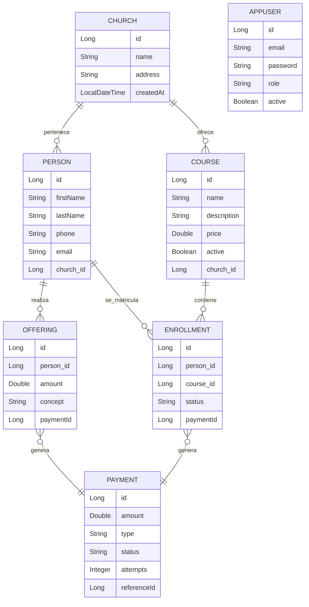

# ADR — Refactorización Arquitectónica del sistema ERP Iglesias

## Información General

| Campo    | Valor                              |
| -------- | ---------------------------------- |
| Proyecto | ERP Iglesias                       |
| Curso    | Arquitectura de Software           |
| Autor    | Sebastián Osorio y Karina cantillo |
| Fecha    | 2026                               |
| Versión  | 1.0                                |

---

# 1. Contexto del Sistema

El sistema **ERP Iglesias** es una plataforma web que permite administrar la información de una iglesia, incluyendo:

- Personas
- Cursos
- Matrículas
- Ofrendas
- Pagos
- Usuarios del sistema

La arquitectura actual funciona correctamente, pero presenta algunos problemas de diseño:

- Controladores con demasiadas responsabilidades
- Lógica de negocio mezclada con la capa web
- DTOs definidos dentro de controladores
- Falta de manejo centralizado de excepciones
- Duplicación de lógica
- Acoplamiento fuerte entre capas

Estas situaciones violan principios de **Clean Code** y **SOLID**, lo que dificulta la mantenibilidad y escalabilidad del sistema.

Por esta razón se plantea una refactorización incremental mediante **Architecture Decision Records (ADR)**.

---

# 2. Arquitectura Tecnológica

## Backend

- Java 17
- Spring Boot 3
- Spring Security
- Spring Data JPA
- PostgreSQL
- JWT

## Frontend

- Angular 17

## Infraestructura

- Docker
- Docker Compose

---

# 3. Modelo Entidad Relación (MER)

El modelo conceptual del sistema es el siguiente.

